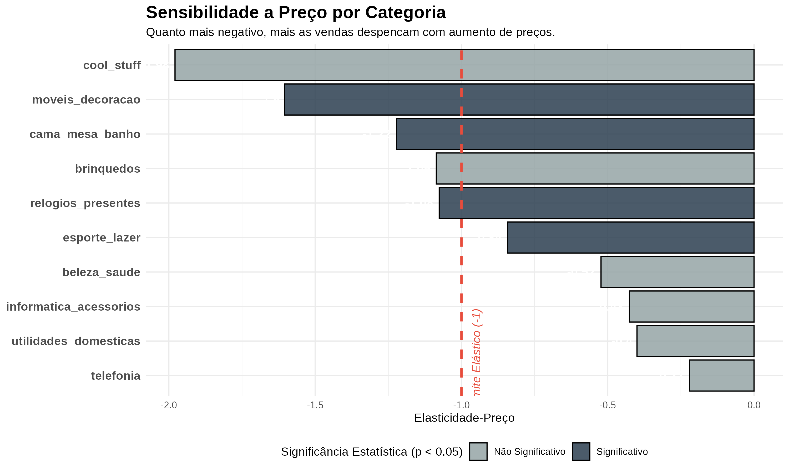
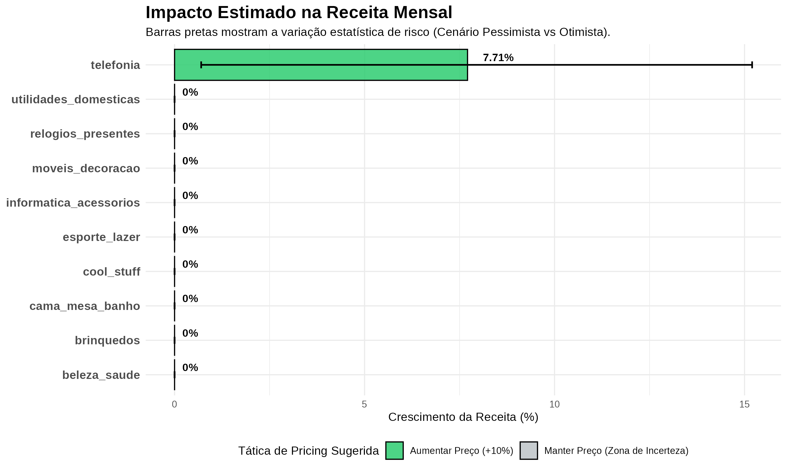

# 📊 Otimização de Pricing & Inferência Causal: E-commerce (Olist)

## 🎯 O Problema de Negócio
No varejo, decisões de alteração de preço (dar descontos ou aumentar margem) costumam ser feitas baseadas em intuição ou médias simples. O problema dessa abordagem é que ela ignora a volatilidade do mercado, sazonalidades (como Black Friday) e, principalmente, o **risco estatístico**. 

Este projeto tem como objetivo responder a duas perguntas fundamentais para um e-commerce:
1. **Qual é a elasticidade-preço da demanda** para as top categorias de produtos?
2. **Como podemos simular impactos na receita** garantindo uma margem de segurança (gestão de risco) contra a incerteza dos dados?

## 🧠 Metodologia: O Diferencial Técnico (Estado da Arte)
Para garantir que a recomendação de preços não quebre o caixa da empresa, este projeto fugiu de regressões lineares simples (OLS) e implementou técnicas avançadas de **Inferência Causal** e **Econometria**:

* **Dados em Painel:** Agrupamento de dados no nível `Produto x Mês` para acompanhar o ciclo de vida e a variação temporal de preços.
* **Transformação Logarítmica e Mediana:** Uso de $ln(Preço)$ e Medianas para mitigar o impacto de fortíssimos *outliers* na distribuição de preços do e-commerce brasileiro.
* **PPML (Poisson Pseudo-Maximum Likelihood):** Como a distribuição de demanda no varejo possui uma "cauda longa" (assimetria forte à direita, com muitos produtos vendendo 1 ou 2 unidades), regressões lineares falham miseravelmente. O modelo PPML é o padrão-ouro acadêmico e de mercado para esses casos.
* **Efeitos Fixos (Fixed Effects):** Inclusão de efeitos fixos para `product_id` e `ano_mes` para isolar a elasticidade real, expurgando o "ruído" de sazonalidades (ex: pico irreal de vendas no Natal).
* **Gestão de Risco via Intervalo de Confiança:** Decisões de negócio não foram baseadas apenas na elasticidade pontual, mas sim nos **limites inferiores e superiores (95% CI)**, simulando cenários Otimistas e Pessimistas de impacto na receita.

## 📈 Principais Resultados e Insights
O simulador final aplicou uma regra de negócio defensiva: só mexer no preço se o **Intervalo de Confiança inteiro** permitir, caso contrário, a categoria entra em uma **"Zona de Incerteza"** (Manter Preço).

1. **Ação Clara (Telefonia):** O modelo detectou que a categoria de *Telefonia* possui um comportamento inelástico seguro. A recomendação estatística aprova um **aumento de 10% no preço**, com uma estimativa de **+7.71% no crescimento da receita mensal**.
2. **Bandas de Risco:** Para *Telefonia*, a simulação projetou um ganho de receita em todos os cenários, variando de **+0.70% (Pessimista)** a **+15.2% (Otimista)**.
3. **Maturidade Analítica:** Categorias como *Cama, Mesa e Banho* e *Esporte e Lazer* apresentaram elasticidade negativa alta, mas seus intervalos de confiança cruzam o limite elástico/inelástico. O modelo, de forma inteligente, recomendou **NÃO alterar os preços** para essas categorias, protegendo o negócio de um risco desnecessário.

## 🛠️ Tecnologias e Pacotes Utilizados
* **R:** Linguagem base para manipulação e modelagem.
* **`fixest`:** Pacote de altíssima performance para modelagem econométrica avançada com múltiplos Efeitos Fixos (PPML).
* **`dplyr` & `tidyr`:** Data wrangling e construção do Painel de Dados.
* **`ggplot2`:** Visualização de dados e criação de gráficos de impacto focados em negócio.

## 📁 Como navegar neste repositório
- `script_pricing_olist.R`: O código completo contendo todo o pipeline (ETL, EDA, Modelagem e Simulação).
- `simulacao_pricing_olist.csv`: Tabela exportada com a recomendação final de tática de preços e cálculo de impacto em receita.
- `eda_04_estatisticas_descritivas.csv`: Tabela com o resumo de estatísticas descritivas (incluindo contagem de outliers via regra de Tukey).
- **Imagens:** Os gráficos gerados de EDA, Elasticidade e Impacto na Receita.

---
### 💡 Gráficos de Destaque

**1. Diagnóstico de Elasticidade por Categoria**

**2. Impacto Estimado na Receita Mensal com Gestão de Risco (Barras de Erro)**

